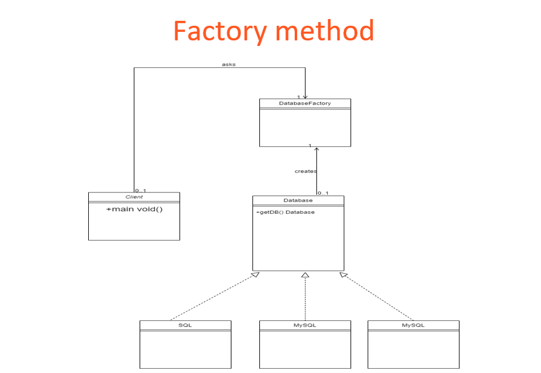

**Factory Method**
- Design logic is hidden from the client.
- Many subclass types, only one instance required.
- Creation is removed from client.
- Useful for frequent code changes.

- Interface or abstract class that defines the common functionality.
- Interface implementations.
- Factory class that instantiates the right implementation.
- 